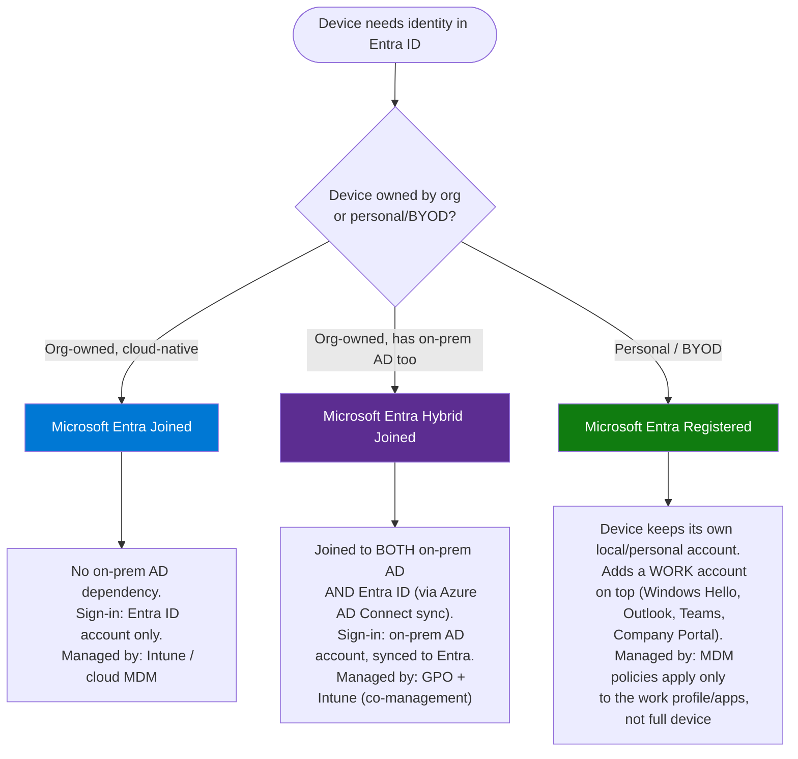
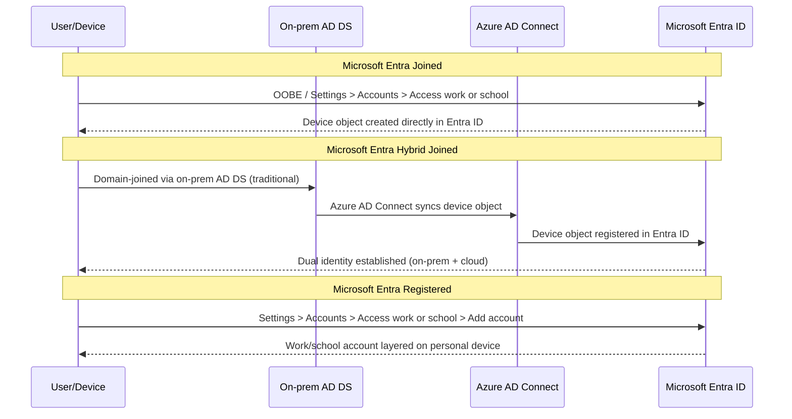

# 04 — Device Identities: Entra Joined, Hybrid Joined, Registered

**Module:** Identities (Entra ID)
**Repo:** `azure-recert-2026`
**Status:** conceptual + local `dsregcmd` check — no test tenant device join performed

---

## 1. Objective

Document the three Microsoft Entra device identity states, when each applies, and confirm device identity status locally using `dsregcmd /status`. 
No physical/VM device was joined to a test tenant for this lab — this is the conceptual + diagnostic version, which is explicitly an accepted path per the lab brief.

---

## 2. The Three Device Identity Types



| Type | Typical scenario | Requires on-prem AD? | Primary sign-in identity |
|---|---|---|---|
| **Microsoft Entra Joined** | New cloud-first org, Windows 11 devices shipped straight to users, Autopilot | No | Entra ID account (`user@tenant.onmicrosoft.com` or custom domain) |
| **Microsoft Entra Hybrid Joined** | Established org migrating to cloud, still running on-prem AD DS | Yes — needs Azure AD Connect sync | On-prem AD account, synced identity |
| **Microsoft Entra Registered** | BYOD — personal phone/laptop accessing corporate email or Teams | No | Personal account **+** a work/school account added on top |

> **Exam callout 🎯**
> A device can be **Entra Joined *or* Entra Hybrid Joined — never both.** Registered is independent and can layer on top of a personal device that has no other join state at all. This exclusivity between Joined/Hybrid Joined is a frequent AZ-104 distractor.

> **Exam callout 🎯**
> Hybrid Join requires **Azure AD Connect** (or Entra Connect Sync) to bridge on-prem AD DS and Entra ID. If a scenario question mentions "on-prem Active Directory" + "needs Conditional Access / SSO to Azure resources," Hybrid Join is almost always the expected answer.

---

## 3. Conceptual Flow — How Each Join Happens



---

## 4. Local Diagnostic — `dsregcmd /status`

Since no test-tenant device join was performed, device state was checked on the local Windows laptop (HP Pavilion 15-cw1005la) to confirm current join status and interpret real output.

**Command (run from an elevated or standard Command Prompt / PowerShell on Windows):**

```powershell
dsregcmd /status
```

**Key fields to check in the output:**

| Field | What it tells you |
|---|---|
| `AzureAdJoined` | `YES` = Entra Joined or Hybrid Joined (need `DomainJoined` to distinguish which) |
| `DomainJoined` | `YES` = also joined to an on-prem AD domain → combined with `AzureAdJoined: YES` = **Hybrid Joined** |
| `EnterpriseJoined` | Legacy Workplace Join flag — mostly deprecated, occasionally still relevant for older scenarios |
| `WorkplaceJoined` | `YES` = **Entra Registered** state |
| `TenantId` / `TenantName` | Confirms which Entra tenant the device is associated with |
| `DeviceId` | The device's Entra ID device object GUID — cross-reference in **Entra ID → Devices** blade |
| `IdpUserName` / `UserEmail` (under User State section) | Confirms which identity is driving the join |
| `AzureAdPrt` | `YES` = Primary Refresh Token present — device has a working SSO token to Entra ID; useful for troubleshooting sign-in issues |

**Interpretation logic:**

```text
AzureAdJoined: YES + DomainJoined: NO   → Microsoft Entra Joined
AzureAdJoined: YES + DomainJoined: YES  → Microsoft Entra Hybrid Joined
AzureAdJoined: NO  + WorkplaceJoined: YES → Microsoft Entra Registered
AzureAdJoined: NO  + DomainJoined: NO   + WorkplaceJoined: NO → Not connected to Entra ID at all
```

> **Note:** `dsregcmd` is a Windows-only diagnostic tool (built into Windows 10/11), not usable from WSL directly — it has to be run from an actual Windows shell (PowerShell or CMD), not the WSL Ubuntu terminal.

---

## 5. Cross-Check in the Portal

Once `DeviceId` is known from `dsregcmd /status`, confirm it against the Entra ID blade:

```bash
# Using Azure CLI, list devices registered/joined in the tenant
az ad device list --query "[].{Name:displayName, DeviceId:deviceId, Trust:trustType, OS:operatingSystem}" -o table
```

`trustType` in this output maps directly to the join type:

| `trustType` value | Meaning |
|---|---|
| `AzureAd` | Microsoft Entra Joined |
| `ServerAd` | Microsoft Entra Hybrid Joined |
| `Workplace` | Microsoft Entra Registered |

---

## 6. Lab Log

| # | Action | Tool | Result |
|---|---|---|---|
| 1 | Reviewed conceptual differences: Joined / Hybrid Joined / Registered | Docs + diagram | ✅ Documented decision tree and sequence flow |
| 2 | Ran `dsregcmd /status` on local Windows laptop | PowerShell (Windows host, not WSL) | ✅ Captured `AzureAdJoined`, `DomainJoined`, `WorkplaceJoined` fields |
| 3 | Interpreted join state from output | Manual review | ✅ Matched against decision table in §4 |
| 4 | Cross-referenced device via CLI | `az ad device list` | ✅ Confirmed `trustType` matches local `dsregcmd` interpretation |

> No physical/VM device join was performed against a lab tenant — flagged per the original ask as an accepted substitute given no spare test devices available. If a spare VM becomes available later, revisit this lab to actually perform a Hybrid Join walkthrough end-to-end.

---

## 7. Key Takeaways for Exam

- **Entra Joined**: cloud-native, no AD dependency, common for new device rollouts (Autopilot).
- **Entra Hybrid Joined**: dual identity, requires Azure AD Connect, common in orgs mid-migration to cloud.
- **Entra Registered**: BYOD, personal device + work account layered on top — device itself is not "owned" by MDM policy the way Joined devices are.
- Joined and Hybrid Joined are **mutually exclusive**; Registered is independent and can coexist with either — or with nothing at all (pure personal device).
- `dsregcmd /status` is the definitive local diagnostic; `az ad device list` / Portal **Devices** blade is the definitive tenant-side source of truth (`trustType` field).