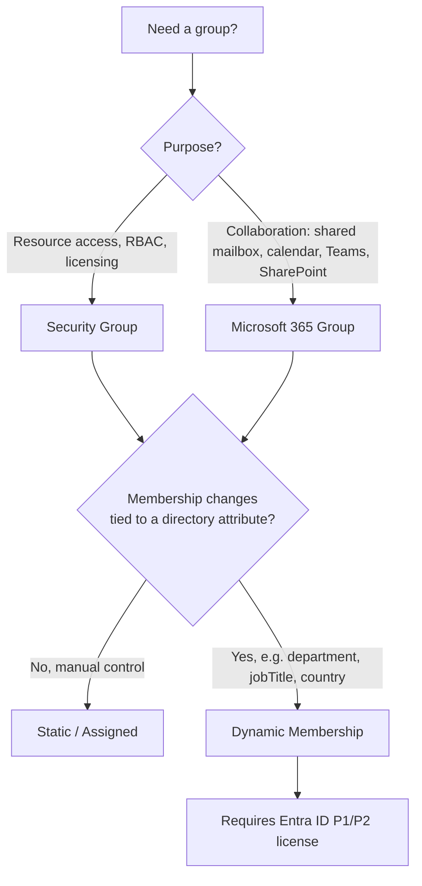

# 03 — Group Accounts: Static vs. Dynamic Membership
 
**Module:** Identities (Entra ID)
**Repo:** `azure-recert-2026`

---
 
## 1. Objective
 
Create and compare two group models in Microsoft Entra ID:
 
1. A **Security group** with **static (assigned)** membership.
2. A **Microsoft 365 group** with **dynamic membership**, using a rule based on `department`.
Document the dynamic rule syntax and the operational reasoning behind choosing dynamic over static membership.
 
---
 
## 2. Group Type Decision
 

 
## 3. Lab Steps: 

### 3.1 Static Security Group
 
Portal path: **Entra ID → Management → Groups → New group**

| Field | Value |
|---|---|
| Group type | Security |
| Group name | `sg-lab-infra-static` |
| Membership type | Assigned |
| Members | Manually added (2–3 test users) |

CLI equivalent:
 
```bash
az ad group create \
  --display-name "sg-lab-infra-static" \
  --mail-nickname "sglabinfrastatic"
 
az ad group member add \
  --group "sg-lab-infra-static" \
  --member-id <object-id-of-user>
```

### 3.2 Microsoft 365 Group — Dynamic Membership
 
Portal path: **Entra ID → Groups → New group**
 
| Field | Value |
|---|---|
| Group type | Microsoft 365 |
| Group name | `m365-lab-it-dynamic` |
| Membership type | Dynamic User |
| Dynamic membership rule | `(user.department -eq "IT")` |

CLI equivalent (dynamic rule requires Graph, not `az ad group create` directly for the rule — noted in §5):
 
```bash
az ad group create \
  --display-name "m365-lab-it-dynamic" \
  --mail-nickname "m365labitdynamic" \
  --group-types "Unified"
```
 
> Dynamic membership rules aren't settable via `az ad group create`; they're applied through the Portal, Microsoft Graph API, or PowerShell (`New-MgGroup` with `-MembershipRule`). Flagged in §5 as an Azure CLI limitation.
 
---
 
## 4. Dynamic Membership Rule Used
 
```text
(user.department -eq "IT")
```
 
**Breakdown:**
 
| Component | Meaning |
|---|---|
| `user.department` | Directory attribute read from each user object (populated via Entra ID profile or synced from on-prem AD) |
| `-eq` | Equality operator (case-insensitive string match) |
| `"IT"` | Literal value the attribute must match |
 
**Why this rule:**
 
- `department` is a standard, low-friction attribute to govern — it's typically already populated by HR systems or on-prem AD sync (Azure AD Connect), so no extra provisioning work is needed to make the rule useful.
- It demonstrates **attribute-based access at scale**: as soon as a user's `department` field is set to `IT` (new hire, transfer), they're added automatically — no ticket, no manual group edit.
- It equally demonstrates automatic **removal**: if a user transfers out of IT, membership evaluation removes them within the sync cycle, which is the real value over static groups (access hygiene / least privilege maintained without manual offboarding steps).
---
 
## 5. Static vs. Dynamic — Comparison
 
| Criteria | Static (Assigned) | Dynamic |
|---|---|---|
| Membership control | Manual add/remove | Rule-evaluated automatically |
| License requirement | None extra | Entra ID **P1** (user) / **P2** (device, some advanced rules) |
| Best for | Small, stable groups; one-off access | Groups tied to HR/org attributes (department, country, job title) |
| Admin overhead | Grows with org size | Near-zero after rule is set |
| Rule settable via `az ad group create`? | N/A | **No** — needs Portal, Graph API, or `New-MgGroup -MembershipRule` |
| Risk | Stale membership if offboarding is missed | Rule errors can silently exclude/include unintended users — test rule syntax before production rollout |
 
> **Exam callout 🎯**
> A group **cannot** be both dynamic and have manually assigned members at the same time — membership type is set at creation and is exclusive (Assigned vs. Dynamic User vs. Dynamic Device).
 
---
 
## 6. Lab Log
 
| # | Action | Tool | Result |
|---|---|---|---|
| 1 | Created static security group `sg-lab-infra-static` | Portal / Azure CLI | ✅ Created, 2 test members added manually |
| 2 | Created M365 group `m365-lab-it-dynamic` | Portal | ✅ Created with `Unified` group type |
| 3 | Applied dynamic rule `(user.department -eq "IT")` | Portal → Dynamic membership rules | ✅ Rule validated, syntax passed |
| 4 | Set test user's `department` attribute to `IT` | Entra ID → User profile | ✅ User auto-added within a few minutes (processing delay observed) |
| 5 | Attempted rule via `az ad group create` | Azure CLI | ❌ Not supported — confirmed rule must be set via Portal/Graph/PowerShell |
 
> **Note:** Dynamic group membership evaluation is not instant — Microsoft documents this as eventual, typically within minutes but can take longer under load. Don't expect real-time updates in a demo.
 
---
 
## 7. Key Takeaways for Exam
 
- Security groups → access/permissions/licensing. M365 groups → collaboration (Outlook, Teams, SharePoint).
- Dynamic membership needs **Entra ID P1** (P2 mentioned for device rules in some docs — verify current licensing table before exam day).
- Dynamic rules use attribute-based syntax like `user.department -eq "IT"`, `user.jobTitle -contains "Engineer"`, etc.
- A group's membership type (Assigned / Dynamic User / Dynamic Device) is fixed at creation — exclusive, not combinable.
- Rule changes and membership evaluation aren't instantaneous — plan around processing delay, don't rely on immediate propagation.

