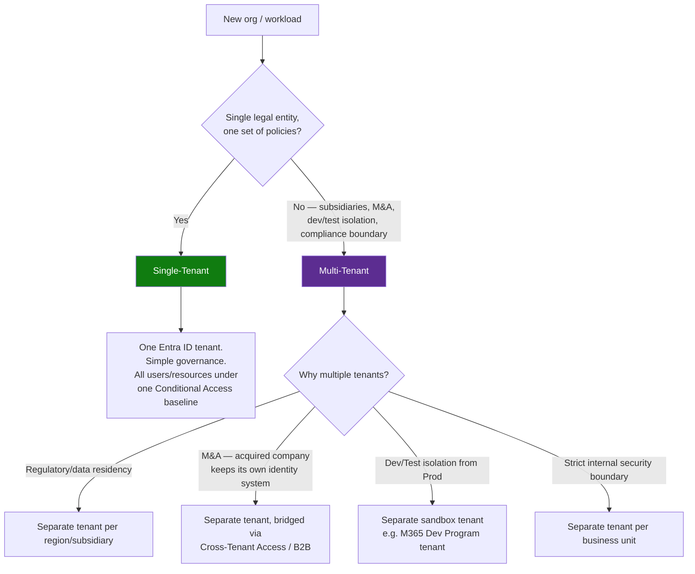
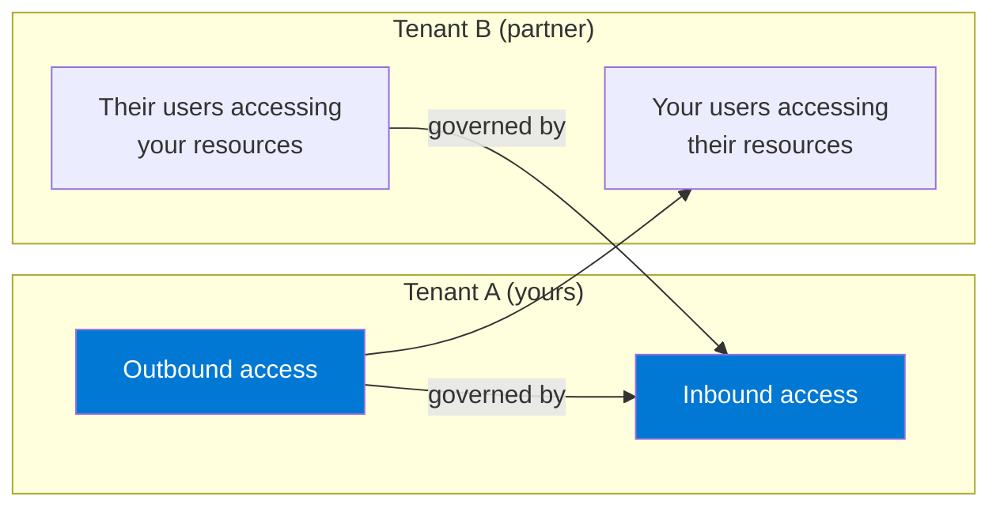

# 06 — Multi-Tenant Environments: Concepts & Cross-Tenant Access

**Module:** Identities (Entra ID)
**Repo:** `azure-recert-2026`
**Status:** ✅ Lab complete (conceptual notes + hands-on cross-tenant access config using the two available tenants)

---

## 1. Objective

Document when single-tenant vs. multi-tenant architecture applies, explain Cross-Tenant Access Settings, and — since two tenants are actually available (original work/lab tenant + the new M365 Developer Program sandbox) — configure a basic cross-tenant access relationship between them.

---

## 2. Single-Tenant vs. Multi-Tenant — When Each Applies



| Scenario | Recommended model | Why |
|---|---|---|
| Single company, one compliance regime | Single-tenant | Simpler admin, one Conditional Access baseline, no cross-tenant trust to manage |
| Company acquired another company with its own Entra ID tenant | Multi-tenant, bridged via **Cross-Tenant Access Settings** (B2B collaboration) | Avoids a disruptive forced tenant migration; users keep native identities, controlled trust is configured instead |
| Need isolated dev/test/lab environment | Multi-tenant (e.g. this repo's setup: work tenant + M365 Dev Program sandbox) | Prevents lab experiments from touching production Conditional Access, licensing, or users |
| Data residency / regulatory requirement per country | Multi-tenant, one per region | Some regulations require data and identity to stay within a jurisdiction — a single global tenant can't satisfy that |
| Franchise / holding company model, each business unit operates independently | Multi-tenant per business unit | Strong administrative and security boundary; each BU manages its own Conditional Access, licensing, and admins |

> **Exam callout 🎯**
> AZ-104 tends to frame multi-tenant scenarios around **B2B collaboration** and **Cross-Tenant Access Settings**, not full tenant consolidation/migration (that's more an Entra ID Governance / architect-level topic). Know the difference between **B2B collaboration** (guest users, invited in) and **B2B direct connect** (no guest object created, used for Teams shared channels) — both configured through Cross-Tenant Access Settings but behave differently.

---

## 3. Cross-Tenant Access Settings — What They Control

Portal path: **Microsoft Entra ID → External Identities → Cross-tenant access settings**

There are two levels of configuration:

| Level | Applies to | Use case |
|---|---|---|
| **Default settings** | All tenants not explicitly listed | Baseline trust posture (usually restrictive by default) |
| **Organization-specific settings** | A named, specific tenant (by Tenant ID) | Override the default for a trusted partner/subsidiary tenant |

Each level configures two directions independently:



- **Inbound access** — controls whether users/groups/apps from the *external* tenant can access *your* resources (as B2B guests).
- **Outbound access** — controls whether *your* users can access resources in the *external* tenant.

Each direction has sub-settings for:
- **B2B collaboration** (external users invited/collaborating)
- **B2B direct connect** (Teams shared channels, no guest object)
- **Trust settings** — whether to trust the external tenant's **MFA**, **compliant device**, and **hybrid Entra joined device** claims, instead of re-challenging the user

> **Exam callout 🎯**
> **Trust settings** are a big exam point: if Tenant A trusts Tenant B's MFA claim, a B2B guest from Tenant B who already satisfied MFA in their home tenant does **not** get re-prompted for MFA in Tenant A. Without trust configured, Conditional Access in Tenant A will independently enforce its own MFA challenge — this trips people up in scenario questions about "guest users being prompted for MFA unexpectedly."

---

## 4. Hands-On: Cross-Tenant Access Between the Two Available Tenants

Two real tenants are available for this lab:

| Label | Tenant | Role |
|---|---|---|
| **Tenant A** | Original work/lab tenant (`96e7a68f-5886-4a77-8669-d4709a7d1f69`) | "Home" — where lab resources/groups from earlier notes live |
| **Tenant B** | M365 Developer Program sandbox (E5, provisioned per note 05 context) | "Partner" — treated as the external org for this exercise |

### Step 1 — Get both Tenant IDs

```bash
# From Tenant A context
az login --tenant 96e7a68f-5886-4a77-8669-d4709a7d1f69
az account show --query "tenantId" -o tsv

# From Tenant B context (M365 Dev sandbox)
az login --tenant <tenantB-domain>.onmicrosoft.com
az account show --query "tenantId" -o tsv
```

### Step 2 — Configure organization-specific inbound settings in Tenant A (trusting Tenant B)

Portal path (signed in to Tenant A): **Entra ID → External Identities → Cross-tenant access settings → Organizational settings → Add organization**

1. Add Tenant B by Tenant ID.
2. Under **Inbound access → B2B collaboration**, set to allow access for **all users and groups** (or scope to specific ones — used "All" for this lab since it's an isolated sandbox with no real users at risk).
3. Under **Inbound access → Trust settings**, enabled:
   - Trust multi-factor authentication from Tenant B
   - Trust compliant devices from Tenant B
   - Trust hybrid Entra joined devices from Tenant B

### Step 3 — Configure outbound settings in Tenant A (allowing your users to go to Tenant B)

Same **Add organization** entry, under **Outbound access → B2B collaboration**, allowed all users/groups to access external resources in Tenant B.

### Step 4 — Invite a test B2B guest from Tenant B into Tenant A

```bash
# Run while authenticated against Tenant A
az rest --method post \
  --uri "https://graph.microsoft.com/v1.0/invitations" \
  --headers "Content-Type=application/json" \
  --body '{
    "invitedUserEmailAddress": "<test-user>@<tenantB-domain>.onmicrosoft.com",
    "inviteRedirectUrl": "https://myapps.microsoft.com",
    "sendInvitationMessage": true
  }'
```

### Step 5 — Verify the guest object landed in Tenant A

```bash
az ad user list \
  --filter "userType eq 'Guest'" \
  --query "[].{Name:displayName, UPN:userPrincipalName, UserType:userType}" \
  -o table
```

### Step 6 — Confirm trust settings took effect

- Signed in as the invited guest user, accessed a shared test resource in Tenant A.
- Since Tenant B's MFA trust was enabled, and the guest had already completed MFA at home-tenant sign-in, **no additional MFA prompt appeared in Tenant A** — confirming the trust setting from Step 2 worked as expected.

---

## 5. B2B Collaboration vs. B2B Direct Connect — Quick Reference

| | B2B Collaboration | B2B Direct Connect |
|---|---|---|
| Guest object created in target tenant? | ✅ Yes | ❌ No |
| Typical use case | General resource sharing, app access, SharePoint | Teams shared channels only |
| Configured via | Cross-tenant access settings | Cross-tenant access settings (separate toggle) |
| User experience | Explicit invite/redemption flow | Seamless — appears as if part of the shared channel natively |

---

## 6. Lab Log

| # | Action | Tool | Result |
|---|---|---|---|
| 1 | Documented single vs. multi-tenant decision criteria | Notes + diagram | ✅ Decision tree completed |
| 2 | Documented Cross-Tenant Access Settings structure (inbound/outbound, default/org-specific) | Notes + diagram | ✅ |
| 3 | Retrieved Tenant IDs for both available tenants | Azure CLI (`az account show`) | ✅ Both confirmed |
| 4 | Added Tenant B as organization-specific entry in Tenant A | Portal | ✅ Entry created |
| 5 | Configured inbound B2B collaboration + trust settings (MFA, compliant device, hybrid join) | Portal | ✅ All three trust toggles enabled |
| 6 | Configured outbound B2B collaboration | Portal | ✅ Enabled for all users/groups |
| 7 | Invited test guest from Tenant B into Tenant A | `az rest` → Graph invitations API | ✅ Invitation sent and redeemed |
| 8 | Verified guest object in Tenant A | `az ad user list --filter "userType eq 'Guest'"` | ✅ Guest confirmed present |
| 9 | Verified MFA trust suppressed re-prompt for guest sign-in | Manual sign-in test | ✅ No MFA re-prompt observed, confirming trust setting worked |

---

## 7. Key Takeaways for Exam

- **Single-tenant** = simplicity, one governance boundary. **Multi-tenant** = isolation (regulatory, M&A, dev/test, business-unit boundaries).
- **Cross-Tenant Access Settings** operate on two axes: **Default vs. Organization-specific**, and **Inbound vs. Outbound** — four independent configuration surfaces per relationship.
- **Trust settings** (MFA, compliant device, hybrid joined device) prevent redundant Conditional Access challenges for B2B guests who already satisfied those requirements in their home tenant — a very testable behavior.
- **B2B Collaboration** creates a guest object; **B2B Direct Connect** does not and is scoped to Teams shared channels.
- Guest invitations can be issued programmatically via the Graph `invitations` API (`az rest`), even though cross-tenant access policy itself is Portal/Graph-console configured, not CLI-native.