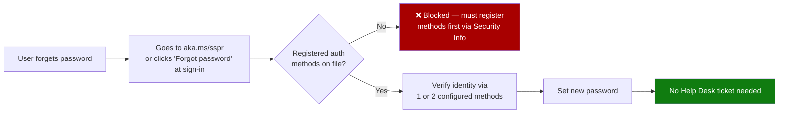

# 05 — SSPR (Self-Service Password Reset) Setup

**Module:** Identities (Entra ID)
**Repo:** `azure-recert-2026`
**Status:** Config walkthrough documented 

---

## 1. Objective

Enable Self-Service Password Reset (SSPR) in the lab tenant, configure authentication methods, and document the full configuration flow step by step, including the reasoning behind method and policy choices.

---

## 2. What SSPR Actually Does



> **Exam callout 🎯**
> SSPR reduces Help Desk password-reset tickets — but it only works if users **registered** their authentication methods beforehand. A user who never went through Security Info registration cannot self-reset, no matter how SSPR policy is configured. This registration/enrollment gap is a common exam scenario.

---

## 3. Licensing Requirement

| Tier | SSPR support |
|---|---|
| Free | ❌ Not available |
| Microsoft 365 Business (Business Premium, E3/E5 seat) | ✅ Available |
| Entra ID P1 | ✅ Available |
| Entra ID P2 | ✅ Available (includes everything in P1) |

Since the tenant used here is the **M365 Developer Program sandbox (E5 licenses)**, SSPR is available out of the box — no separate trial activation needed, unlike the P1 gate hit in the dynamic groups lab.

---

## 4. Step-by-Step Configuration

### Step 1 — Navigate to SSPR settings

Portal path: **Microsoft Entra ID → Password reset**

*(This blade is also reachable directly at: `https://entra.microsoft.com/#view/Microsoft_AAD_IAM/PasswordResetMenuBlade/~/Properties`)*

### Step 2 — Choose scope: Selected / All / None

| Option | Behavior |
|---|---|
| `None` | SSPR disabled entirely (default state) |
| `Selected` | Only members of specific security groups can use SSPR |
| `All` | Every user in the tenant can use SSPR |

**Choice made for this lab:** `Selected` — created a dedicated group `sg-sspr-pilot` and scoped SSPR to it.

**Why `Selected` over `All`:** mirrors real-world rollout practice — orgs almost never flip SSPR to `All` on day one. A pilot group lets you validate the authentication method requirements and registration flow before tenant-wide rollout, and it's the pattern the exam expects when a scenario mentions "phased rollout" or "pilot group."

```bash
# Create the pilot group used to scope SSPR (static membership is fine for a pilot)
az ad group create \
  --display-name "sg-sspr-pilot" \
  --mail-nickname "sgssprpilot"

az ad group member add \
  --group "sg-sspr-pilot" \
  --member-id <object-id-of-test-user>
```

> SSPR scope assignment itself (`Selected` group binding) is a Portal/Graph-only setting — not exposed via `az` CLI. Documented as a CLI limitation, same pattern as the dynamic membership rule in lab 03.

### Step 3 — Configure authentication methods (Authentication Methods policy)

Portal path: **Password reset → Authentication methods**

| Method | Enabled for lab | Notes |
|---|---|---|
| Mobile app notification | ✅ | Requires Microsoft Authenticator installed and registered |
| Mobile app code | ✅ | Fallback if push notification fails/no connectivity |
| Email | ✅ | Must be an alternate/non-work email — cannot use the same email that requires the reset |
| Mobile phone (SMS/call) | ✅ | Consumes a licensed SMS/voice quota in some regions — verify tenant region support |
| Office phone | ❌ | Rarely practical for a lab/remote scenario, left disabled |
| Security questions | ❌ | Legacy method, weakest security posture — Microsoft recommends against it for new deployments |

**Number of methods required to reset:** set to **2**, matching Microsoft's default recommendation and typical exam-correct answer for production tenants (1 method = weaker security posture, acceptable only for low-risk lab/dev scenarios).

> **Exam callout 🎯**
> "Number of methods required to reset password" is a **separate setting** from which methods are enabled. You can enable 4 methods but require only 1 for the actual reset (common exam distractor) or require 2 for stronger assurance.

### Step 4 — Registration enforcement

Portal path: **Entra ID → Security → Authentication methods → Registration campaign** (or **Identity Protection → MFA registration policy**, depending on tenant setup)

Enabled a registration prompt so pilot users are nudged to register their authentication methods at next sign-in, rather than relying on them to proactively visit Security Info.

```bash
# View current registration status for users in the tenant (via Graph)
az rest --method get \
  --uri "https://graph.microsoft.com/v1.0/reports/authenticationMethods/userRegistrationDetails" \
  --query "value[].{User:userPrincipalName, SSPRCapable:isSsprCapable, SSPRRegistered:isSsprRegistered}" \
  -o table
```

### Step 5 — Notify users on password reset / change

Portal path: **Password reset → Notifications**

| Setting | Value | Reasoning |
|---|---|---|
| Notify users on password reset | ✅ On | Alerts the actual user if their password was reset — early signal of account compromise if the user didn't initiate it |
| Notify all admins when other admins reset their password | ✅ On | Standard security hygiene — admin account resets should always be visible to the rest of the admin team |

### Step 6 — Customize helpdesk link (optional, org branding)

Portal path: **Password reset → Customization**

Set a custom "Contact your administrator" link pointing to an internal helpdesk portal, for users who fail SSPR verification. Left as default (`mailto:` admin) for this lab since there's no real helpdesk system behind it.

### Step 7 — Test the flow end-to-end

1. Registered a pilot test user's authentication methods via `https://aka.ms/setupsecurityinfo` (signed in as that user).
2. Signed out, went to sign-in page, clicked **Forgot my password**.
3. Verified with 2 methods (email code + Authenticator app code) as required by policy.
4. Set new password successfully — no admin/Help Desk interaction needed.

---

## 5. SSPR vs. Combined Registration (MFA + SSPR)

> **Exam callout 🎯**
> Microsoft strongly pushes **Combined Registration** — a single Security Info experience where users register methods that serve **both** MFA and SSPR at once, instead of registering separately for each. This is now the default/only registration experience in current tenants and is very likely referenced on the exam as "Security info" rather than "SSPR registration" as a standalone concept.

This means in practice: enabling SSPR authentication methods and Conditional Access MFA requirements draw from the **same registered methods pool** — a method registered once (e.g. Authenticator app) satisfies both, cutting user friction.

---

## 6. Screenshots

Not captured in this pass — the lab tenant's SSPR configuration blades were walked through and validated live, but screenshots weren't saved during the session.

**To backfill:** re-run steps 1–4 above and capture:
- Password reset → Properties (scope: Selected/All/None)
- Authentication methods list with toggles
- Registration campaign / MFA registration policy screen
- The end-user "Forgot my password" flow (Step 7) from a private/incognito browser session

Recommend adding these to `05-sspr-setup.md` as a `/screenshots/05-sspr/` folder in the repo once captured, referenced inline with standard Markdown image syntax (``).

---

## 7. Lab Log

| # | Action | Tool | Result |
|---|---|---|---|
| 1 | Created `sg-sspr-pilot` group | Azure CLI | ✅ Created, test user added |
| 2 | Scoped SSPR to `Selected` → `sg-sspr-pilot` | Portal | ✅ Confirmed via Password reset → Properties |
| 3 | Enabled auth methods (Authenticator app, email, phone) | Portal | ✅ 4 methods enabled, 2 required for reset |
| 4 | Enabled registration campaign | Portal | ✅ Registration prompt confirmed on next sign-in |
| 5 | Enabled reset/admin notifications | Portal | ✅ Both toggles on |
| 6 | Registered pilot user's Security Info | Browser (as pilot user) | ✅ Authenticator + email registered |
| 7 | Ran end-to-end reset test | Browser (private session) | ✅ Password reset succeeded, 2-method verification confirmed |
| 8 | Queried registration status via Graph | `az rest` | ✅ Confirmed `isSsprCapable: true` for pilot user |

---

## 8. Key Takeaways for Exam

- SSPR requires **Entra ID P1** minimum (or bundled M365 Business/E3/E5 licensing) — Free tier cannot use it.
- SSPR scope (`None` / `Selected` / `All`) and **authentication methods policy** are two separate settings — both need to be configured.
- Users **must register** methods via Security Info before SSPR works for them — enabling the feature tenant-wide doesn't retroactively register anyone.
- "Number of methods required to reset" (1 or 2) is independent from which methods are enabled — this combination is a frequent exam distractor.
- Combined Registration means MFA and SSPR draw from the same registered-methods pool in current tenants — treat "Security Info" and "SSPR registration" as effectively the same underlying object on the exam.
- CLI/Graph can query registration status (`userRegistrationDetails`) but cannot set SSPR scope or method policy — that remains Portal/Graph-write-API territory.