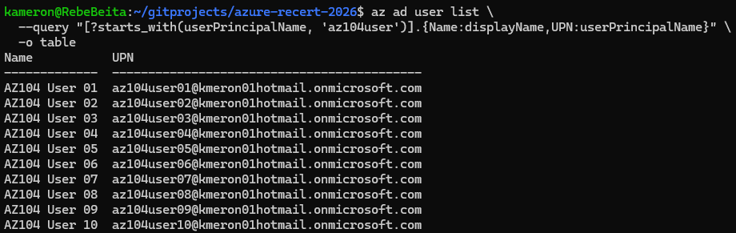
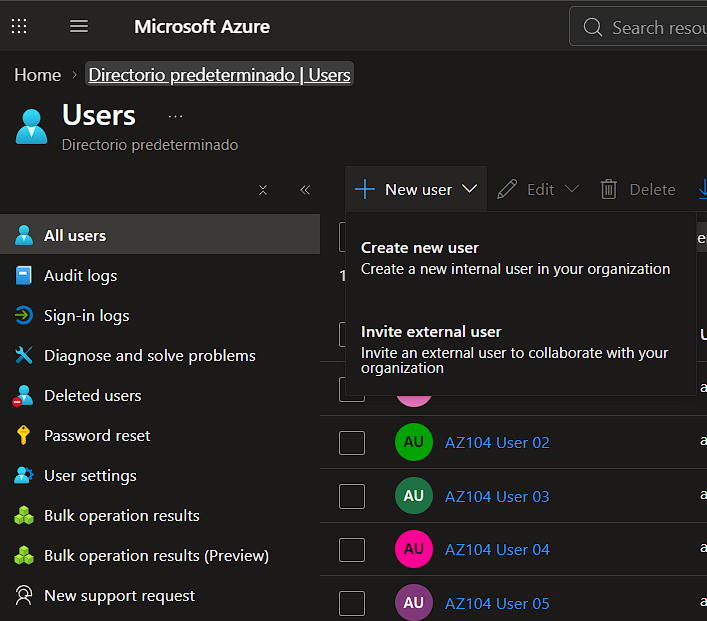

# Creation of users in Microsoft Entra ID: 

## Via CLI: 

**To create a users:**

```bash
az ad user create \
  --display-name "AZ104 User 01" \
  --password "Master09" \
  --user-principal-name "az104user01@kmeron01hotmail.onmicrosoft.com"
```


**To create Multiple users:**

```bash
for i in {01..10}; do
    az ad user create \
        --display-name "AZ104 User $i" \
        --password "Master09" \
        --user-principal-name "az104user$i@kmeron01hotmail.onmicrosoft.com"
done
```

**To query the users creation:**

``` bash
az ad user list \
  --query "[?starts_with(userPrincipalName, 'az104user')].{Name:displayName,UPN:userPrincipalName}" \
  -o table
```

**Result:**


## Via Portal: 

- Microsoft Entra ID > Manage (Section) > Users (It Opens new Users Section) > All Users > New user

**Result:**



