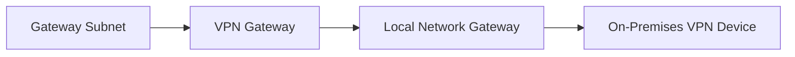
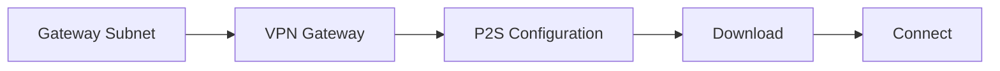
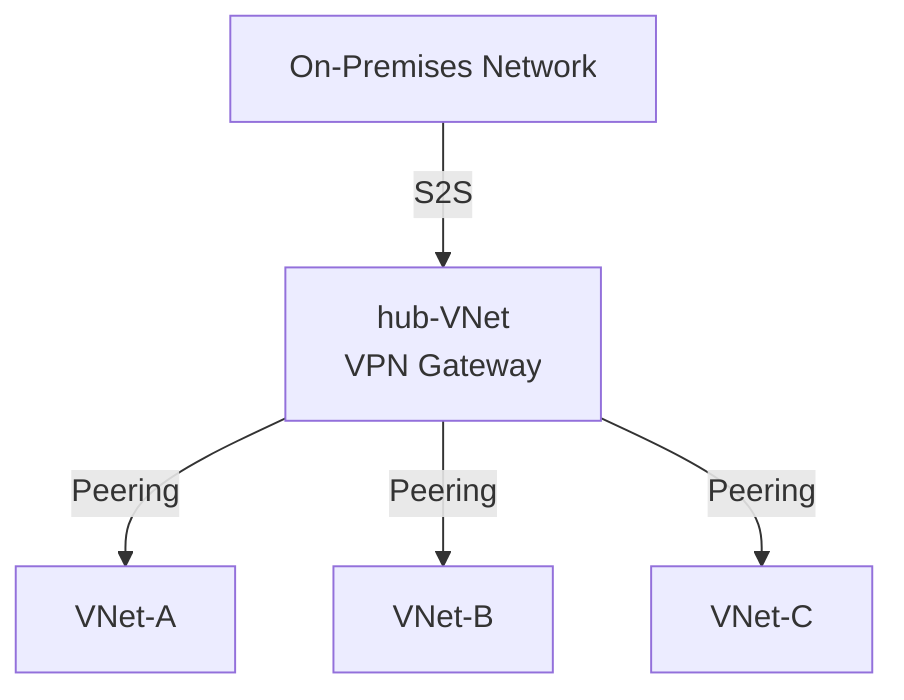
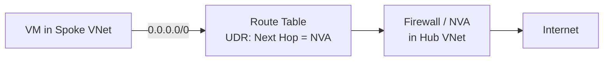
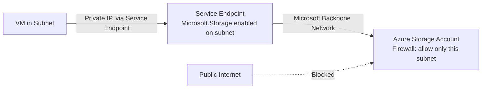
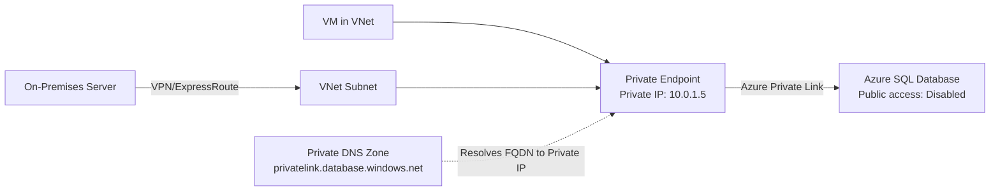

# Azure Networking Notes — AZ-104

## Index
- [VNet Peering vs VNet-to-VNet Connection](#vnet-peering-vs-vnet-to-vnet-connection)
- [Site-to-Site Connection](#site-to-site-connection)
- [Point-to-Site Connection](#point-to-site-connection)
- [Gateway Transit](#gateway-transit)
- [User-Defined Routes (UDR)](#user-defined-routes-udr)
- [Service Endpoints](#service-endpoints)
- [Private Endpoints](#private-endpoints)

---

<details>
<summary><strong>VNet Peering vs VNet-to-VNet Connection</strong></summary>

| Property | VNet Peering | VNet-to-VNet Connection |
|---|---|---|
| Number of connections | Up to 500 VNet peerings per VNet | One VNet can have only VPN Gateway and connection count is SKU dependent |
| Pricing | Ingress + Egress | Gateway hourly cost + egress |
| Encryption | No encryption. Software level is recommended. | IPsec/IKE |
| Bandwidth | No restrictions | SKU dependent |
| Route | Routed via Microsoft backbone network and is private | Routed via public internet, however encrypted |
| Public IP | No public IP or internet is used | Public IP is involved |
| Transitivity | Nontransitive | Transitive (BGP enabled) |
| Initial setup time | Fast | ~ 30-40 minutes |
| Use cases | Data replication, database failover, and other scenarios needing frequent backups of large data. | Scenarios where encryption is needed and not latency/bandwidth sensitive. |

</details>

---

<details>
<summary><strong>Site-to-Site Connection</strong></summary>



**Flow explanation:**
1. **Gateway Subnet** – A dedicated subnet within the Azure VNet reserved exclusively for gateway resources (no NSGs applied here).
2. **VPN Gateway** – The Azure-side resource deployed into the Gateway Subnet; encrypts and terminates the VPN tunnel from the Azure side.
3. **Local Network Gateway** – Represents the on-premises network's identity in Azure (public IP + address prefixes of the on-prem network).
4. **On-Premises VPN Device** – The physical/virtual VPN appliance at the customer's site that establishes the IPsec/IKE tunnel back to the Azure VPN Gateway.

**Fallback (no Mermaid support):**
```
Gateway Subnet → VPN Gateway → Local Network Gateway → On-Premises VPN Device
```

</details>

---

<details>
<summary><strong>Point-to-Site Connection</strong></summary>



**Flow explanation:**
1. **Gateway Subnet** – Dedicated subnet in the Azure VNet reserved for gateway resources.
2. **VPN Gateway** – The Azure-side resource deployed into the Gateway Subnet, used as the P2S endpoint.
3. **P2S Configuration** – Point-to-Site settings configured on the VPN Gateway (address pool, tunnel type — OpenVPN/IKEv2/SSTP, and authentication method — certificate, RADIUS, or Azure AD).
4. **Download** – The user downloads the VPN client configuration package generated by Azure for their OS.
5. **Connect** – The client installs the downloaded config and initiates the connection from their individual device to the VNet.

**Fallback (no Mermaid support):**
```
Gateway Subnet → VPN Gateway → P2S Configuration → Download → Connect
```

</details>

---

<details>
<summary><strong>Gateway Transit</strong></summary>



**Flow explanation:**
- **hub-VNet** – Central VNet hosting the shared VPN Gateway; connects to the on-premises network via a **Site-to-Site (S2S)** VPN connection.
- **VNet-A, VNet-B, VNet-C** – Spoke VNets, each peered directly to the hub-VNet.
- **Gateway Transit** – A peering property enabled on the hub side that lets spoke VNets (A, B, C) use the hub's VPN Gateway to reach on-premises resources, **without each spoke needing its own gateway**.
- **Key point:** Peering itself is nontransitive by default — spokes can't talk to each other or to on-premises through the hub *unless* Gateway Transit is explicitly enabled on the peering connection.

**Fallback (no Mermaid support):**
```
                On-Premises Network
                        │
                       S2S
                        │
                     hub-VNet
                    /    │    \
              Peering Peering Peering
                /        │        \
            VNet-A     VNet-B    VNet-C
```

</details>

---

<details>
<summary><strong>User-Defined Routes (UDR)</strong></summary>

### Definition
A **User-Defined Route (UDR)** is a custom route that an administrator manually creates within an Azure **Route Table** to override Azure's default system routes and control how traffic is directed between subnets, VNets, on-premises networks, or the internet.

### Explanation
By default, Azure automatically creates system routes for:
- Traffic within a VNet (subnet-to-subnet)
- Traffic from a VNet to the internet
- Traffic between peered VNets

These defaults work fine for basic scenarios, but sometimes you need traffic to take a specific path — for example, forcing all outbound traffic through a firewall/NVA (Network Virtual Appliance) instead of going directly to its destination. That's where UDRs come in.

**Key components:**
| Component | Description |
|---|---|
| **Route Table** | The container resource that holds one or more UDRs, associated to one or more subnets. |
| **Address Prefix** | The destination CIDR block the rule applies to (e.g., `0.0.0.0/0` for all traffic). |
| **Next Hop Type** | Where matching traffic should be sent: `Virtual Appliance`, `VNet Gateway`, `VNet`, `Internet`, or `None` (drop traffic). |
| **Next Hop IP Address** | Required when Next Hop Type is `Virtual Appliance` — the private IP of the NVA/firewall. |

### Example use case — Forced Tunneling through a Firewall (Hub-Spoke)
Route all outbound spoke traffic through a central firewall NVA in the hub VNet for inspection, instead of letting it go straight to the internet.



**How it works in this example:**
1. A **Route Table** is created with a UDR: destination `0.0.0.0/0` (all traffic), next hop type `Virtual Appliance`, next hop IP = the firewall's private IP.
2. The Route Table is **associated with the spoke subnet**.
3. Instead of VMs sending traffic directly to the internet (the default system route), all outbound traffic is forced through the firewall/NVA first.
4. The firewall inspects/filters traffic, then forwards it to the internet.

**Fallback (no Mermaid support):**
```
VM (Spoke VNet) → Route Table (UDR: next hop = NVA) → Firewall/NVA (Hub VNet) → Internet
```

</details>

---

<details>
<summary><strong>Service Endpoints</strong></summary>

### Definition
A **Service Endpoint** extends a VNet's private address space and identity to an Azure PaaS service (like Storage or SQL Database) over the **Microsoft backbone network**, allowing resources in a subnet to reach that service without traversing the public internet.

### Explanation
By default, traffic from a VNet to an Azure PaaS service (e.g., Azure Storage, Azure SQL, Cosmos DB, Key Vault) goes out over the **public internet**, even though it stays within Azure's network internally — and the service can only be secured with firewall rules based on public IP ranges.

**Service Endpoints solve this by:**
- Enabling a direct, optimized route from the subnet to the PaaS service over Microsoft's backbone (no public internet hop).
- Allowing you to lock down the PaaS service's firewall to accept traffic **only from specific VNet subnets**, instead of broad public IP ranges.
- The source IP of traffic switches from the VM's public IP to its **private IP** once the endpoint is enabled — removing the need for the PaaS resource to allow the VNet's public IP.

**Important characteristics:**
| Property | Detail |
|---|---|
| Scope | Enabled per subnet, per Azure service (e.g., `Microsoft.Storage`, `Microsoft.Sql`) |
| Routing | Traffic stays on Microsoft's backbone network |
| Security | PaaS resource firewall restricted to allow only the specific subnet |
| Cost | No additional charge for Service Endpoints themselves |
| Scope limitation | Only secures traffic **from within Azure**, not from on-premises (that requires Private Endpoint instead) |
| Regional | Endpoint works for services in the same region as the VNet (with a few exceptions) |

### Example use case
Restrict an **Azure Storage Account** so it can only be accessed from VMs in a specific subnet — not from the public internet at all.



**How it works in this example:**
1. **Service Endpoint** for `Microsoft.Storage` is enabled on the VM's subnet.
2. The **Storage Account firewall** is configured to allow traffic only from that specific virtual network/subnet.
3. Traffic from the VM to Storage now travels over the Microsoft backbone using the VM's private IP, instead of routing out to the public internet.
4. Any request coming from outside that subnet (including the public internet) is **blocked** by the storage firewall.

**Fallback (no Mermaid support):**
```
VM (Subnet, Service Endpoint enabled) → Microsoft Backbone Network → Storage Account (firewall: subnet-only)
Public Internet → Storage Account = Blocked
```

</details>

---

<details>
<summary><strong>Private Endpoints</strong></summary>

### Definition
A **Private Endpoint** is a network interface that uses a **private IP address from your VNet** to connect privately and securely to an Azure PaaS service (like Storage, SQL, Key Vault) powered by **Azure Private Link**, effectively bringing the service *into* your VNet's address space.

### Explanation
Unlike a Service Endpoint (which extends your VNet's identity *out* to the service), a Private Endpoint brings the PaaS service *into* your VNet by assigning it a private IP from one of your subnets. The PaaS service becomes reachable via that private IP, from anywhere with network connectivity to the VNet — including **on-premises networks** via VPN/ExpressRoute, and **peered VNets**.

**Key differences from Service Endpoints:**
| Property | Service Endpoint | Private Endpoint |
|---|---|---|
| IP address | Traffic uses VM's private IP, but service keeps public IP | Service gets a **private IP** inside your VNet |
| On-premises access | Not supported | Supported (via VPN/ExpressRoute) |
| Peered VNet access | Not supported (unless separately configured) | Supported |
| Data exfiltration protection | Limited | Strong — no public endpoint exposure needed |
| DNS | No change needed | Requires Private DNS Zone integration to resolve correctly |
| Cost | Free | Hourly charge + data processing charge |
| Granularity | Subnet-level | Resource-level (can target a specific sub-resource, e.g., blob vs file) |

**Important characteristics:**
- Uses **Azure Private Link** under the hood.
- Requires a **Private DNS Zone** (or custom DNS) so the service's FQDN resolves to the private IP instead of the public one.
- Can fully **disable public network access** on the PaaS resource for maximum isolation.
- Works across regions and across subscriptions/tenants (with approval).

### Example use case
Allow a VM and an **on-premises server** (connected via VPN) to reach an **Azure SQL Database** privately, with the public endpoint completely disabled.



**How it works in this example:**
1. A **Private Endpoint** is created in the VNet's subnet, assigned a private IP (e.g., `10.0.1.5`), targeting the SQL Database.
2. A **Private DNS Zone** (`privatelink.database.windows.net`) is linked to the VNet so the SQL Database's FQDN resolves to that private IP instead of its public one.
3. **Public network access is disabled** on the SQL Database — it's no longer reachable from the internet at all.
4. Both the VM (directly in the VNet) and the on-premises server (via VPN into the VNet) can now reach the database privately over the Microsoft backbone.

**Fallback (no Mermaid support):**
```
On-Premises Server → VPN → VNet Subnet ─┐
                                          ├─→ Private Endpoint (private IP) → Azure SQL Database (public access disabled)
VM in VNet ──────────────────────────────┘
Private DNS Zone resolves FQDN → Private IP
```

</details>