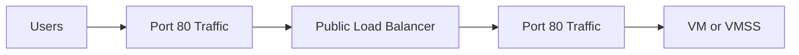
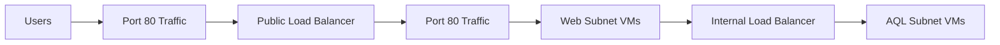

# Azure Networking Notes — AZ-104

## Index
- [Azure_Load_Balancer](#Azure_LoadBalancer)
- [Azure_Load_Balancer_Rules](#Azure_Load_Balancer_Rules)
- [Load_Balancer_Session_Persistence](#Load_Balancer_Session_Persistence)
- [Azure_Application_Gateway](#Azure_Application_Gateway)
- [Application_Gateway—Components](#Application_Gateway—Components)
- [Application_Gateway—Routing_Rules](#Application_Gateway—Routing_Rules)
- [Comparing_Load_Balancing_Solutions](#Comparing_Load_Balancing_Solutions)
- [Network_Watcher](#Network_Watcher)
---

<details>
<summary><strong>Azure Load Balancer</strong></summary>

## What is it?

Azure Load Balancer is a Layer 4 (TCP/UDP) load balancing service. It distributes inbound (and optionally outbound) traffic across a pool of backend resources — VMs, VM scale sets, or IP-based backends — based on a 5-tuple hash (source IP, source port, destination IP, destination port, protocol). Because it operates at Layer 4, it doesn't inspect application-level content like HTTP headers or cookies (that's the job of Layer 7 services like Application Gateway or Azure Front Door).

**Key components:**
- **Frontend IP configuration** – the public or private IP that receives traffic
- **Backend pool** – the set of VMs/instances that receive traffic
- **Health probes** – checks that determine if a backend instance is healthy enough to receive traffic
- **Load balancing rules** – map a frontend IP:port to a backend pool:port
- **NAT rules** – forward traffic from a frontend port to a specific backend instance (used for things like RDP/SSH to a single VM)

**Types:**
- **Public Load Balancer** – load balances internet-facing traffic
- **Internal Load Balancer (ILB)** – load balances traffic within a VNet (no public IP)

## Basic vs. Standard SKU

| Feature | Basic | Standard |
|---|---|---|
| Backend pool size | Up to 300 instances | Up to 1000 instances |
| Health probes | TCP, HTTP | TCP, HTTP, HTTPS |
| Redundancy | Not available | Zone redundant and zonal redundant |
| Multiple frontend | Inbound only | Inbound and outbound |
| Security | Open by default. NSG is optional | Closed, unless traffic is allowed by NSG |
| SLA | Not applicable | 99.99% |

### Why this matters (exam angle)
- **Standard is the default and recommended SKU** for production workloads — Basic is being retired (Microsoft has announced Basic SKU retirement, so expect Standard-focused questions on AZ-104).
- **Security default is a common trick question**: Basic is open by default (relies on NSGs being explicitly configured to lock things down); Standard is closed by default (you must explicitly allow traffic via NSG). This flips the usual assumption people make.
- **SKU must match**: Public IP SKU, Load Balancer SKU, and VM/VMSS NIC configuration all need to use the same SKU tier (Basic or Standard) — mixing them is not supported.
- **Zone redundancy** is a Standard-only feature — important for HA/DR scenarios and for the "design for high availability" objective domain.
- **Outbound rules** (SNAT) are only configurable on Standard — Basic relies on default outbound access, which is also being deprecated.

## Typical use case
Put a Standard Public Load Balancer in front of a VM Scale Set running a web app, with an HTTP health probe on `/health`, so traffic only routes to instances that are actually up — while NSGs explicitly control what's allowed in.

## Public Trafic Example diagram: 



## Internal Trafic Example diagram: 



---
</details>

---

---

<details>
<summary><strong>Azure Load Balancer Rules</strong></summary>

Azure Load Balancer uses two main rule types to control how traffic reaches backend VMs: **load balancing rules** and **inbound NAT rules**. Both map a frontend (Load Balancer's IP/port) to a backend (VM's IP/port), but they solve different problems.

## Load Balancing Rules

Distribute traffic **across multiple VMs** in a backend pool. One frontend IP:port maps to *many* backend instances, and the Load Balancer decides which instance handles each connection (based on the 5-tuple hash).

- **Use case:** Users hitting a web app — any of the VMs in the WebSubnet can serve the request.
- **Example from diagram:** Users connect once through the frontend; the load balancing rule distributes that traffic across all three VMs in the backend pool.

## Inbound NAT Rules

Forward traffic from a **specific frontend port** to a **specific single VM's port** — a 1:1 mapping. This is how you reach an individual instance directly (e.g., for management), rather than "whichever VM is next in line."

- **Use case:** An admin needing RDP (port 3389) access to a *particular* VM.
- **Example from diagram:** Each VM gets its own unique frontend port (30008, 30009, 30010) mapped to port 3389 on that specific VM. The admin picks the port matching the VM they want to reach:
  - `30008:3389` → VM 1
  - `30009:3389` → VM 2
  - `30010:3389` → VM 3

## Side-by-side

| | Load Balancing Rule | Inbound NAT Rule |
|---|---|---|
| Mapping | Frontend → many backend VMs | Frontend port → one specific backend VM |
| Purpose | Distribute traffic across a pool | Direct access to a single instance |
| Typical traffic | App/web traffic (HTTP/HTTPS) | Management traffic (RDP/SSH) |
| Who uses it (diagram) | Users | Admin |

## Exam angle (AZ-104)
- Inbound NAT rules are the standard way to provide RDP/SSH access to individual VMs behind a Load Balancer **without giving each VM its own public IP**.
- Each VM needs a **unique frontend port** for its NAT rule (you can't reuse the same frontend port for two different NAT rules).
- Both rule types live on the **same Load Balancer** and can target the **same backend pool** simultaneously — they're not mutually exclusive.
- **NAT pools/rules on VM Scale Sets** work slightly differently (Azure can auto-assign a port range across instances) — worth double-checking if a question involves VMSS instead of standalone VMs.

---

---
</details>

---

---

<details>
<summary><strong>Load_Balancer_Session_Persistence</strong></summary>


Session persistence (also called "session affinity") controls whether repeat requests from the **same client** get sent to the **same backend VM**, or whether the Load Balancer is free to redistribute each new connection using its normal hashing behavior.

## The three modes

### None (default)
No affinity — each new TCP/UDP session is distributed based on the 5-tuple hash (source IP, source port, destination IP, destination port, protocol). Since source port changes per connection, the same client can land on a *different* VM every time it opens a new connection. Best for even load distribution when the app is stateless.

### Client IP
Uses a 2-tuple hash (source IP, destination IP). Requests from the same client IP are routed to the same backend VM, regardless of source port. Useful when the app expects some continuity per client but you don't control session state externally.

### Client IP and protocol
Uses a 3-tuple hash (source IP, destination IP, protocol). Same as Client IP affinity, but also factors in the protocol (TCP/UDP), so persistence is protocol-specific.

## Side-by-side

| Mode | Hash tuple | Same VM guaranteed when... |
|---|---|---|
| None (default) | 5-tuple | Never guaranteed — new connection = potential new VM |
| Client IP | 2-tuple | Same source IP → destination IP |
| Client IP and protocol | 3-tuple | Same source IP → destination IP → protocol |

## Exam angle (AZ-104)
- **Default is "None"** — don't assume affinity is on unless explicitly configured.
- Session persistence is set **per load balancing rule**, not globally on the Load Balancer.
- This is a **Layer 4 mechanism** — it's based on IP/protocol, not cookies or application session tokens (that's Application Gateway's cookie-based affinity, a Layer 7 feature — don't mix these up on the exam).
- Stateless apps (e.g., scaled-out web tier storing session state in Redis/SQL) generally don't need persistence, since any VM can serve any request — this keeps distribution even.
- Apps that keep session state **locally in memory on each VM** typically need "Client IP" or "Client IP and protocol" persistence, or they'll break when a client's requests bounce between VMs.

---
*Study note — Load Balancer Session Persistence (AZ-104 recert prep)*

---
</details>

---

---

<details>
<summary><strong>Azure_Application_Gateway</strong></summary>


Application Gateway is a **Layer 7** (application layer) load balancer. Unlike Azure Load Balancer (Layer 4), it can inspect HTTP/HTTPS traffic itself — headers, URL paths, cookies — and make routing decisions based on that content, not just IP/port.

## Three core capabilities

### Layer 7 Load Balancer
Distributes HTTP/HTTPS traffic across backend pools with awareness of the actual request content (not just IP/port hashing like Layer 4).

### Routing and Features
Includes URL path-based routing, multi-site hosting, SSL/TLS termination, cookie-based session affinity, and Web Application Firewall (WAF) integration.

### Backend Pools
The destinations traffic gets routed to — can be VMs, VM Scale Sets, on-prem/external servers via IP or FQDN, or App Services.

## Request flow (from diagram)

```
Browser → Application Gateway → HTTP/HTTPS Listener → Rule → Backend Pool (VM / VMSS / Servers)
```

1. **Browser** sends a request.
2. **Application Gateway** receives it on its public/private frontend IP.
3. **HTTP/HTTPS Listener** — checks the incoming traffic against a configured protocol, port, and hostname. This is the entry point that "listens" for matching requests.
4. **Rule** — connects a listener to a backend pool and an HTTP setting, determining how the request should be routed (basic or path-based).
5. **HTTP Setting** — defines how Application Gateway talks to the backend (protocol, port, cookie-based affinity, timeout, probe association). Applied as part of the rule, sitting between rule and backend pool.
6. **Backend Pool** — the actual targets: VM, VMSS, or Servers (on-prem/external via IP/FQDN).

## Application Gateway vs. Load Balancer (quick contrast)

| | Application Gateway | Load Balancer |
|---|---|---|
| OSI Layer | 7 (Application) | 4 (Transport) |
| Routing basis | URL path, host header, cookies | IP/port 5-tuple hash |
| SSL termination | Yes | No |
| WAF | Yes (optional) | No |
| Session affinity | Cookie-based | Client IP-based |
| Typical use | Web apps, API routing | Any TCP/UDP workload |

## Exam angle (AZ-104)
- **Listener → Rule → HTTP Setting → Backend Pool** is the core chain to remember — each rule needs exactly one listener but can route to different backend pools based on path (path-based routing) or host (multi-site).
- **HTTP Setting** is often confused with the listener — the listener defines how AGW receives traffic; the HTTP Setting defines how AGW forwards it to the backend.
- Application Gateway needs its **own dedicated subnet** in the VNet (can't share it with VMs).
- Health probes work similarly to Load Balancer's, but can be customized further (expected status codes, custom paths, backend hostname override).
- Choose Application Gateway over Load Balancer when you need **SSL offload, WAF, or content-based routing** — choose Load Balancer for simpler, protocol-agnostic TCP/UDP distribution.

---
*Study note — Azure Application Gateway (AZ-104 recert prep)*

---
</details>

---

---

<details>
<summary><strong>Application_Gateway—Components</strong></summary>

A deeper look at how Application Gateway's building blocks connect to each other, from frontend to backend.

## Component breakdown

### Frontend IP
Defines the VIP (public IP) or ILB (internal/private IP) that Application Gateway listens on.

### Listener
The frontend entry point — listens on a specific **port**, **IP**, and (for HTTPS) **certificate**. This is what "catches" incoming traffic before anything else happens.
- **Port** — the port the listener is bound to (e.g., 80, 443).
- **Certificate** — used for SSL/TLS offloading. Application Gateway terminates SSL here, decrypting traffic before it's forwarded to the backend (backend traffic can then be plain HTTP, reducing compute load on backend servers).

### Rule
The bridge between frontend and backend. A rule ties a **listener** to a **backend pool** via an **HTTP setting**, and defines the routing logic (basic, or path-based).

### HTTP Setting
Settings for how Application Gateway communicates with the backend: protocol, port, cookie-based affinity, request timeout, and which **probe** to use for health checks.
- **Custom Probe** — a user-defined health probe (path, interval, timeout, unhealthy threshold) attached to an HTTP Setting, instead of relying on the default probe behavior.

### Backend Pool
The actual backend instances receiving traffic (VMs, VMSS, App Services, on-prem servers via IP/FQDN).

## Component flow

```
Frontend IP
     ↑
  Listener ──→ Port
     │    └──→ Certificate (SSL offload)
     ↓
   Rule ←── HTTP Setting ←── Custom Probe
     ↓
Backend Pool
```

## Exam angle (AZ-104)
- **Listener = where traffic arrives** (IP + port + cert). **HTTP Setting = how traffic leaves toward the backend** (protocol + port + probe + affinity). These two are the most commonly confused components — remember: listener is frontend-facing, HTTP setting is backend-facing.
- **SSL offloading** happens at the listener via the certificate — this is a key reason to pick Application Gateway over Load Balancer when backend servers shouldn't have to handle TLS themselves.
- **Custom Probe** overrides the default health probe — needed when your app's health endpoint isn't at `/` or needs specific status code matching.
- A **Rule is the glue**: one listener + one HTTP setting + one backend pool (for basic rules) — or multiple backend pools via path-based rules, each still needing its own HTTP setting.
- Multiple listeners can share the same Frontend IP but differ by port/hostname (multi-site hosting) or by certificate (multiple SSL certs on the same gateway via SNI).

---
*Study note — Application Gateway Components (AZ-104 recert prep)*

---
</details>

---

---

<details>
<summary><strong>Application_Gateway—Routing_Rules</strong></summary>

Application Gateway supports two main routing rule types that both rely on its Layer 7 (L7 LB) capability to inspect the request and decide where it goes. Both examples below also show WAF (Web Application Firewall) sitting in front of the L7 LB, filtering malicious traffic before routing decisions happen.

## Path-Based Routing

Routes requests to **different backend pools based on the URL path**, all under a **single hostname**.

**Example from diagram:** All traffic comes in on `kodekloud.com`, then splits by path:
- `/images/*` → **Image Server Pool**
- `/video/*` → **Video Server Pool**

This lets you run multiple "services" behind one domain — e.g., separating static asset servers from video streaming servers — using one listener and one public IP/hostname, with the rule doing the path matching.

## Multiple-Site Routing

Routes requests to **different backend pools based on hostname**, using a **single Application Gateway** with multiple listeners.

**Example from diagram:**
- `kodekloud.com` → **Learning Pool**
- `kodekloudlabs.com` → **Lab Pool**

This lets you host multiple independent websites/apps on one Application Gateway instance instead of provisioning a separate gateway per domain — each hostname gets its own listener, rule, and backend pool, but they all share the same gateway (and its public IP, WAF policy, etc.).

## Side-by-side

| | Path-Based Routing | Multiple-Site Routing |
|---|---|---|
| Routing key | URL path (`/images/*`, `/video/*`) | Hostname (`kodekloud.com`, `kodekloudlabs.com`) |
| Hostnames | Single hostname | Multiple hostnames |
| Listeners | One listener, one rule with path map | Multiple listeners, one per hostname |
| Use case | Splitting a single app's traffic by content type/service | Hosting multiple distinct sites/apps on one gateway |

## Exam angle (AZ-104)
- Both routing types run on the **same underlying Application Gateway resource** — they're not separate SKUs or products, just different rule configurations.
- **Path-based routing** uses a **URL path map** attached to a rule — each path pattern maps to its own backend pool (and can have its own HTTP setting).
- **Multi-site routing** requires **multiple listeners** on the same Frontend IP, differentiated by **hostname** (and optionally certificate, via SNI, if each site needs its own SSL cert).
- These two can be **combined** — e.g., `kodekloud.com/images/*` and `kodekloud.com/video/*` on one site, while `kodekloudlabs.com` routes entirely differently — a common "design the routing" scenario on the exam.
- **WAF** operates at the gateway level (or per listener with WAF policies) and inspects traffic **before** the L7 LB applies routing rules — it's a security layer, not a routing mechanism.

---
*Study note — Application Gateway Routing Rules (AZ-104 recert prep)*

---
</details>

---

---

<details>
<summary><strong>Comparing_Load_Balancing_Solutions</strong></summary>

Azure has four traffic-distribution services that get confused with each other constantly on the AZ-104 exam. The key differentiator is **OSI layer + scope (global vs. regional) + protocol**.

## Comparison table

| Feature | Application Gateway | Front Door | Load Balancer | Traffic Manager |
|---|---|---|---|---|
| **Usage** | Optimizes delivery from application server farms while increasing security via WAF | Scalable, security-enhanced delivery point for global, microservice-based web apps | Balances inbound/outbound connections and requests to applications or server endpoints | Distributes traffic optimally to services across global Azure regions, providing HA and responsiveness |
| **Protocols** | HTTP, HTTPS, HTTP/2 | HTTP, HTTPS, HTTP/2 | TCP, UDP | Any |
| **Internal support** | Yes | — | Yes | — |
| **Cross region** | No | Yes | Preview | Yes |
| **Environment** | Azure, non-Azure cloud, on-premises | Azure, non-Azure cloud, on-premises | Azure | Azure, non-Azure cloud, on-premises |
| **Security** | WAF | WAF, NSG | NSG | — |

## How to think about it

- **OSI Layer:**
  - Layer 4 (Transport): **Load Balancer**
  - Layer 7 (Application/HTTP): **Application Gateway**, **Front Door**
  - Layer 7 (DNS-based, not actual traffic routing): **Traffic Manager**

- **Scope:**
  - **Regional**: Application Gateway, Load Balancer
  - **Global**: Front Door, Traffic Manager

- **What it actually routes:**
  - **Load Balancer** and **Application Gateway** route the actual network traffic within a region.
  - **Front Door** routes actual HTTP(S) traffic globally (it's a reverse proxy at the edge).
  - **Traffic Manager** doesn't touch traffic at all — it's **DNS-based**, resolving a hostname to the "best" endpoint's IP, then the client connects directly. This is why it supports "Any" protocol — it doesn't inspect the traffic itself.

## Exam angle (AZ-104)
- **"Internal support" gap for Front Door and Traffic Manager** is a strong signal: both are inherently **public/global-facing services**, not for internal-only traffic. If a question asks for an internal-only, regional Layer 7 solution → Application Gateway. Internal-only Layer 4 → Load Balancer.
- **"Cross region = No" for Application Gateway** is a classic trap — people assume L7 = global. AGW is **regional only**; for global HTTP routing you need **Front Door**.
- **Traffic Manager's DNS-based nature** means failover isn't instant — it depends on DNS TTL, unlike Front Door which actively proxies and can fail over faster.
- **WAF availability**: Application Gateway and Front Door both offer WAF (since they inspect L7 content); Load Balancer and Traffic Manager don't (they don't decrypt/inspect HTTP payloads).
- **Load Balancer is the only one restricted to Azure-only environment** — the other three can front non-Azure/on-prem backends too, since they work by IP, hostname, or FQDN, not requiring the backend to literally be an Azure VM.
- Common scenario pattern: *"Global, multi-region web app needing WAF and low-latency edge routing"* → Front Door. *"Single-region web app needing SSL offload and path-based routing"* → Application Gateway. *"Simple TCP/UDP distribution within a VNet"* → Load Balancer. *"DNS-level failover across regions/clouds with no traffic inspection needed"* → Traffic Manager.

---
*Study note — Comparing Load Balancing Solutions (AZ-104 recert prep)*

---
</details>

---

---

<details>
<summary><strong>Network_Watcher</strong></summary>

Network_Watcher

Network Watcher is Azure's regional service for monitoring, diagnosing, and troubleshooting network resources in a VNet. Its tools split into three categories: **diagnostic tools**, **monitoring**, and **logs**.

## Network Diagnostic Tools

| Tool | Purpose |
|---|---|
| **IP flow verify** | Checks whether a specific packet is allowed or denied to/from a VM, telling you *which* NSG rule made that decision. |
| **NSG diagnostic** | Analyzes NSG rules for a resource to explain allow/deny traffic outcomes in more detail than IP flow verify. |
| **Next hop** | Shows the next hop type (VNet peering, Internet, VirtualAppliance, etc.) for traffic from a VM to a destination IP — useful for tracing routing table (UDR) issues. |
| **Effective security rules** | Shows the combined/aggregated NSG rules actually applied to a NIC (merges subnet-level + NIC-level NSGs). |
| **VPN troubleshoot** | Diagnoses VPN gateway and connection health issues. |
| **Packet capture** | Captures actual network traffic to/from a VM remotely, without installing tools on the VM — great for deep packet-level troubleshooting. |
| **Connection troubleshoot** | Tests connectivity between a source (VM) and a destination (VM, FQDN, URI, IP) and reports latency and hop-by-hop results. |

## Monitoring

| Tool | Purpose |
|---|---|
| **Topology** | Visualizes resources in a VNet and how they're interconnected. |
| **Connection monitor (classic)** | Legacy version of continuous connectivity monitoring between endpoints. |
| **Connection monitor** | Continuously monitors connectivity between Azure and hybrid/on-prem endpoints, tracking latency and reachability over time (successor to Connection monitor classic + Network Performance Monitor). |
| **Network Performance Monitor** | Cloud-based hybrid network monitoring solution (via Log Analytics) for performance monitoring across hybrid networks. |

## Logs

| Tool | Purpose |
|---|---|
| **NSG flow logs** | Logs information about IP traffic flowing through an NSG — the source for traffic analytics. |
| **Diagnostic logs** | Captures diagnostic data for network resources (e.g., Load Balancer, Application Gateway, NSG events). |
| **Traffic Analytics** | Analyzes NSG flow logs (via Log Analytics) to provide insights into traffic patterns, security threats, and traffic hotspots. |

## Exam angle (AZ-104)
- **IP flow verify vs. Effective security rules**: IP flow verify tests one specific flow (source/dest IP+port+protocol) and tells you allow/deny; Effective security rules shows you *all* the merged rules applying to a NIC. Know which to reach for based on the question — "why is this specific traffic blocked?" → IP flow verify; "what rules actually apply to this NIC?" → Effective security rules.
- **Next hop** is the go-to tool when routing (not NSG) is suspected — e.g., traffic going to Internet instead of VNet peering due to a misconfigured UDR.
- **NSG flow logs → Traffic Analytics** is a pipeline: flow logs are the raw data source, Traffic Analytics is the analysis layer built on top (requires Log Analytics workspace).
- **Network Watcher must be enabled per region** — it's often auto-enabled when you create a VNet, but exam questions sometimes test whether you know it needs to exist in the same region as the resource being diagnosed.
- **Packet capture** requires the Network Watcher Agent VM extension to be installed on the target VM.

---
*Study note — Network Watcher (AZ-104 recert prep)*

---
</details>

---


