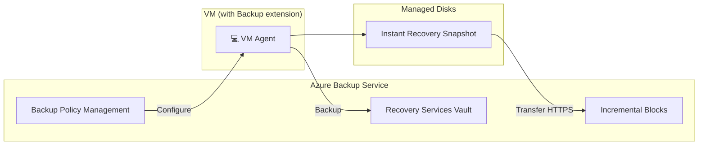

# Virtual Machine Backup — Azure VMs

## Overview
Azure VM backup uses a **snapshot-based, agentless** architecture. The Azure VM Agent (or extension) coordinates with the Azure Backup Service to take snapshots of managed disks, then transfers only the changed data (incremental blocks) to the Recovery Services Vault over HTTPS.

## Architecture Flow

## Key Components

| Component | Description |
|---|---|
| **VM Agent** | Coordinates backup/restore actions on the VM; receives `Configure` and `Backup` commands from the Azure Backup Service. |
| **Managed Disks** | The actual disks attached to the VM (OS disk + data disks) that get snapshotted. |
| **Instant Recovery Snapshot** | A local snapshot taken first, stored temporarily on the managed disks — enables fast restore without waiting for the full transfer to the vault. |
| **HTTPS Transfer** | Secure channel used to move backup data from the snapshot to the vault. |
| **Incremental Blocks** | After the initial full backup, only **changed blocks** are transferred in subsequent backups — reduces time and storage cost. |
| **Recovery Services Vault** | Stores the backup data and manages recovery points. |
| **Backup Policy Management** | Defines schedule, frequency, and retention rules applied to the VM backup. |

## Key Concept — Why Incremental Matters

The **first backup** transfers the full snapshot (slower). Every backup after that only transfers the **incremental blocks** (changed data since the last backup) — this is why initial backups take noticeably longer than subsequent ones, tying directly into what you saw with the "Initial backup pending" warning earlier.

## Key Term

**Instant Recovery Snapshot** — a local, disk-level snapshot retained for a short period (default ~1-2 days depending on policy) that allows near-instant VM restore without needing to pull data back from the vault first.

