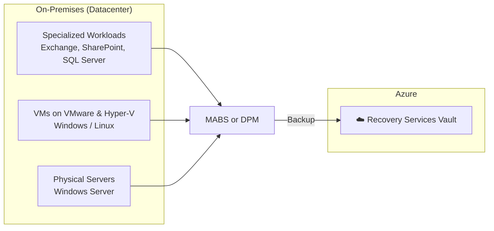

# Virtual Machine Backup — On-Premises VMs

## Overview
For **on-premises workloads**, Azure Backup doesn't connect directly to the Recovery Services Vault the way Azure-native resources do. Instead, there's an intermediary: **MABS (Microsoft Azure Backup Server) or DPM (Data Protection Manager)**, which sits on-premises, collects backups locally, and then pushes them up to the vault.

## Architecture Flow

## What MABS/DPM Can Protect

| Category | Examples |
|---|---|
| **Specialized Workloads** | Exchange, SharePoint, SQL Server (application-aware backup) |
| **Virtual Machines** | VMs running on **Hyper-V** or **VMware**, Windows or Linux guests |
| **Physical Servers** | Bare-metal Windows Server |

## Key Terms

- **MABS (Microsoft Azure Backup Server)** — a free, Azure-focused backup server. No System Center license required. Sends backups to a Recovery Services Vault.
- **DPM (Data Protection Manager)** — part of Microsoft System Center; similar capabilities to MABS but requires a System Center license, typically used in larger enterprise environments already invested in System Center.

## Why This Matters — MABS/DPM vs MARS Agent

This is a critical distinction for AZ-104:

| | MARS Agent | MABS / DPM |
|---|---|---|
| **Protects** | Files, folders only | Full VMs, application-aware workloads (Exchange, SQL, SharePoint), physical servers |
| **App-aware backup** | ❌ No | ✅ Yes |
| **Needs a separate server** | ❌ No | ✅ Yes (MABS/DPM server required) |
| **Linux support** | ❌ No | ✅ Yes (as VM guest on Hyper-V/VMware) |
| **License required** | None | MABS: none / DPM: System Center license |

## Key Exam Points (AZ-104)

1. **On-prem VMs/apps never talk directly to the Recovery Services Vault** — they must go through MABS or DPM first.
2. **VMware and Hyper-V VMs both require MABS/DPM** — neither can be backed up with just the MARS agent.
3. **Application-consistent backups** (Exchange, SQL, SharePoint) require MABS/DPM — MARS agent alone is not application-aware.
4. **MABS = no System Center license**, **DPM = requires System Center license** — this cost/licensing distinction is a common exam trap.
5. The Recovery Services Vault is the **final destination** regardless of path — same vault type used for Azure VM backup, MARS file/folder backup, and MABS/DPM backup.

