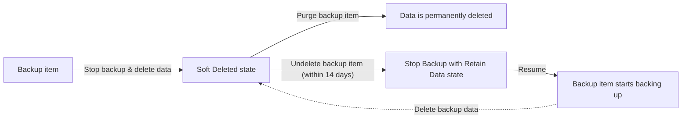

# Manage Soft Delete

## Overview
Azure Backup's **Soft Delete** feature protects backup data from accidental or malicious deletion by retaining it in a recoverable state for a period of time before it's permanently purged.

## Key Facts

- Backup data is retained for **14 additional days** after deletion.
- Soft-deleted backup items can be recovered using an **'Undelete'** operation.
- Available not just for VMs, but also for **storage account containers and file shares**.
- **Natively built-in** for all Recovery Services Vaults — no extra configuration needed to enable the protection itself.

## State Flow Diagram

## The Two Paths from Soft Deleted State

| Path | Action | Result |
|---|---|---|
| **Path 1 — Permanent deletion** | `Purge backup item` | Data is permanently deleted — irreversible, no waiting for the 14-day window. |
| **Path 2 — Recovery** | `Undelete backup item` (within 14 days) | Moves to **"Stop Backup with Retain Data"** state → if you `Resume`, the backup item starts backing up again (protection reactivated). |

## Key Lesson (from hands-on testing)

**Undelete is the recovery path, not the deletion path.** If your goal is to permanently remove a backup item, go straight from **Soft Deleted state → Purge**, without clicking Undelete first — Undelete reactivates the item toward resuming protection, which is the opposite of what you want if trying to delete it for good.

## Lab Log

| Topic | Lab Done? | GitHub Commit | Notes |
|---|---|---|---|
| Manage Soft Delete | ☑ (in progress) | | Learned the hard way: Undelete ≠ Purge. Undelete → Retain Data state → Resume reactivates backup. Correct path to permanently delete is Soft Deleted state → Delete backup data (Purge) directly. |